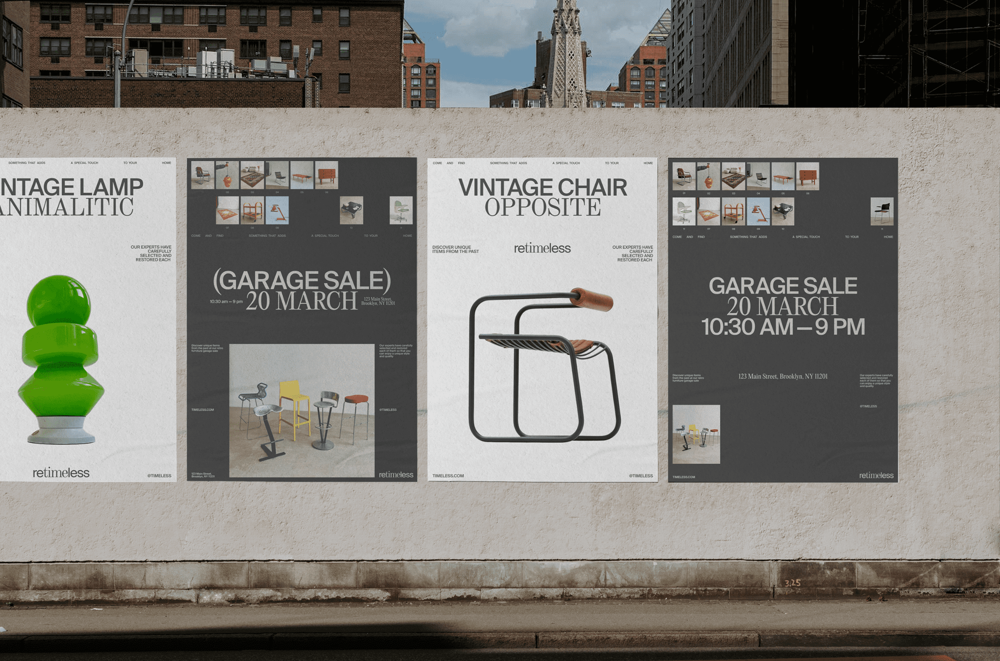

IDENTITY FOR THE FASHION CONCEPT STORE

  
Brand Identity for a niche concept store with a curated selection of contemporary design objects

IDENTITY FOR THE FASHION CONCEPT STORE

  
Brand Identity for a niche concept store with a curated selection of contemporary design objects

IDENTITY FOR THE FASHION CONCEPT STORE

  
Brand Identity for a niche concept store with a curated selection of contemporary design objects

<head>
<link rel="preconnect" href="https://fonts.googleapis.com">
<link rel="preconnect" href="https://fonts.gstatic.com" crossorigin>
<link href="https://fonts.googleapis.com/css2?family=Inter:wght@440&display=swap" rel="stylesheet">
<head>
